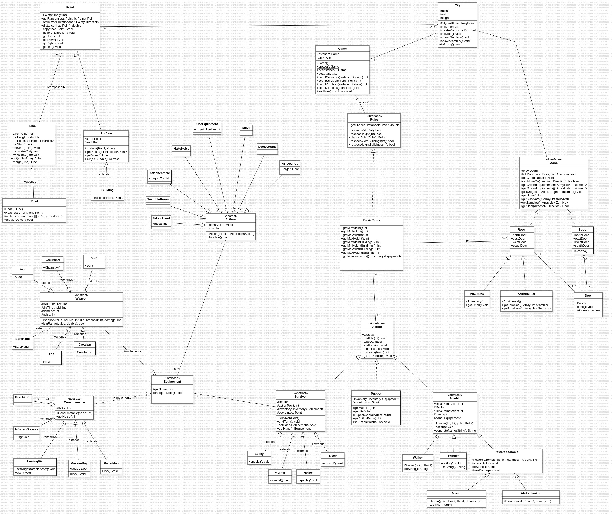

# zombicide Game in Java
# Author : yousra Chbib

*This project is a replica of a game inspired by Zombicide, developed in Java. It includes basic features like managing players, zombies, and possible actions within the game. The goal is to allow players to survive waves of zombies.*

## UML Diagram

The following is a UML diagram that illustrates the architecture of the project.

# Tableau des concepts POO

| **Terme**            | **Définition simple et complète**                                                                          | **Exemple concret (Java-like)**                                      |
|----------------------|-----------------------------------------------------------------------------------------------------------|---------------------------------------------------------------------|
| **Classe**           | Modèle (ou plan) qui définit les attributs et méthodes d’un futur objet                                   | `class Voiture { String marque; void klaxonner() { ... } }`        |
| **Objet**            | Instance concrète d’une classe, c’est-à-dire une utilisation réelle du plan                               | `Voiture v = new Voiture();`                                        |
| **Attribut**         | Variable déclarée dans une classe, représentant une propriété ou état d’un objet                          | `String couleur;` dans la classe `Voiture`                          |
| **Méthode**          | Fonction déclarée dans une classe, définissant un comportement que peut avoir l’objet                     | `void klaxonner() { System.out.println("Bip"); }`                    |
| **Encapsulation**    | Principe qui consiste à protéger les données d’un objet en utilisant `private` + `getters/setters`         | `private int vitesse;` + `public void setVitesse(int v) { vitesse = v; }` |
| **Héritage**         | Mécanisme qui permet à une classe d’hériter des attributs et méthodes d’une autre classe                  | `class Moto extends Vehicule { ... }`                                |
| **Polymorphisme**    | Capacité à utiliser la même méthode avec des comportements différents selon l’objet                        | `animal.faireDuBruit();` → Chien aboie, Chat miaule                 |
| **Abstraction**      | Principe qui consiste à masquer les détails internes et à ne montrer que l’essentiel                      | `abstract class Animal { abstract void crier(); }`                  |
| **Classe Abstraite** | Classe partiellement implémentée qu’on ne peut pas instancier, servant de base                           | `abstract class Animal { void dormir() { ... }; abstract void crier(); }` |
| **Interface**        | Contrat qui oblige une classe à implémenter certaines méthodes, sans fournir d’implémentation              | `interface Volant { void voler(); }` → `class Oiseau implements Volant` |
| **Constructeur**     | Méthode spéciale appelée à la création de l’objet, qui permet de l’initialiser                            | `Voiture(String m) { marque = m; }` → `Voiture v = new Voiture("Toyota");` |
